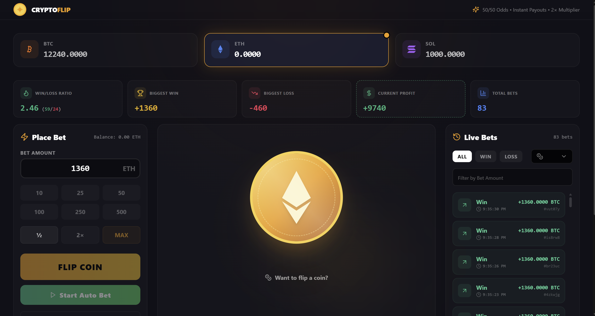

# Coin Flipper

A modern, interactive coin flipping game built with React, TypeScript, and Vite. Place bets, track your balance, and test your luck with multiple cryptocurrencies.

## Live Demo

🌐 **Preview:** [https://coin-flip-11.vercel.app/](https://coin-flip-11.vercel.app/)



## Prerequisites

- Node.js (v18 or higher)
- npm or yarn

## Getting Started

### Clone the Repository

Clone the project to your local machine:

```bash
git clone <repository-url>
cd task
```

Replace `<repository-url>` with the actual repository URL.

### Installation

Install dependencies:

```bash
npm install
```

## Development

Run the development server:

```bash
npm run dev
```

The application will be available at `http://localhost:5173` (or the port shown in the terminal).

## Building for Production

Build the project for production:

```bash
npm run build
```

The production-ready files will be generated in the `dist` directory.

## Preview Production Build

Preview the production build locally:

```bash
npm run preview
```

This will serve the built files from the `dist` directory, allowing you to test the production build before deployment.

## Additional Scripts

- `npm run lint` - Run ESLint to check code quality
- `npm run clean` - Remove build artifacts and cache
- `npm run clean:full` - Full clean including node_modules (requires reinstall)

## Patterns

This project follows several architectural and code patterns:

### 1. Early Return Pattern for Fetching States

Components use early returns to handle loading and error states before rendering the main content. This reduces nesting and improves readability.

**Example:**
```typescript
export const Statistics = () => {
  const { data: stats, isLoading, error, refetch } = useGetStatistics();

  if (isLoading) {
    return <SkeletonCard />;
  }

  if (error) {
    return <ErrorDisplay error={error} onRetry={refetch} />;
  }

  if (!stats) {
    return null;
  }

  return <StatisticsCardsList stats={stats} />;
};
```

**Used in:** `Statistics.tsx`, `BalanceDisplay.tsx`, `BetHistoryList.tsx`

### 2. Controller Pattern

Business logic is organized into controller classes that handle specific domains (History, Balance, Statistics, Game). This separates concerns and makes the codebase more maintainable.

**Example:**
```typescript
export class GameController {
  constructor(
    private historyController: HistoryController,
    private balanceController: BalanceController,
    private statisticsController: StatisticsController
  ) {}
  
  async flipCoin(amount: number, currency: Currency) {
    // Game logic here
  }
}
```

**Used in:** `services/controllers/` directory

### 3. Custom Hooks Pattern

Hooks are organized into three categories:
- **API hooks** (`hooks/api/`) - React Query hooks for data fetching
- **Business logic hooks** (`hooks/business/`) - Complex domain-specific logic
- **Utility hooks** (`hooks/utils/`) - Reusable generic hooks

**Example:**
```typescript
// API hook
export const useBalances = () => {
  return useQuery({
    queryKey: QUERY_KEYS.BALANCES,
    queryFn: () => apiService.getBalances(),
  });
};

// Business logic hook
export const useBetSimulation = () => {
  // Complex betting logic
};
```

**Used in:** `hooks/` directory structure

### 4. Service Layer Pattern

API calls are abstracted through a service layer (`ApiService`) that coordinates between controllers and provides a clean interface for components.

**Example:**
```typescript
export class ApiService {
  async flipCoin(amount: number, currency: Currency) {
    return this.gameController.flipCoin(amount, currency);
  }
}
```

**Used in:** `services/api/ApiService.ts`

### 5. Error Boundary Pattern

Error boundaries are used to catch and handle React errors gracefully, providing fallback UI when components fail.

**Used in:** `components/ui/ErrorBoundary.tsx`

## Tech Stack

- **React 18** - UI library
- **TypeScript** - Type safety
- **Vite** - Build tool and dev server
- **Tailwind CSS** - Styling
- **Zustand** - State management
- **React Query** - Data fetching and caching
- **Framer Motion** - Animations

## Features

- Multiple cryptocurrency support (BTC, ETH, SOL)
- Auto-betting mode
- Martingale betting strategy
- Stop win/loss limits
- Bet history tracking
- Statistics dashboard
- Responsive design
